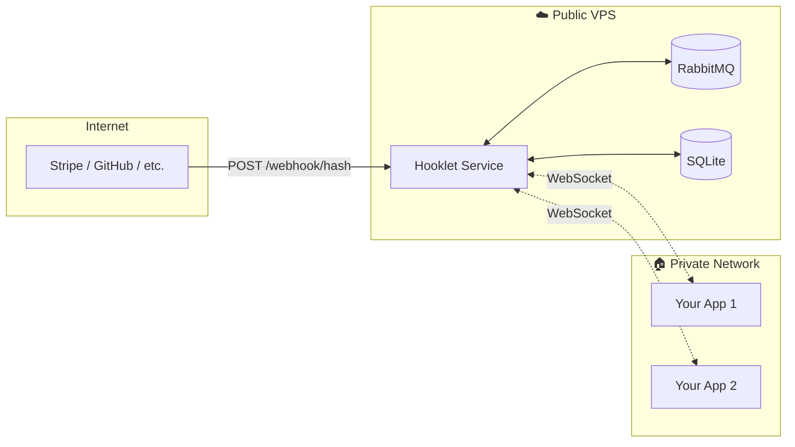

# 🪝 Hooklet

> Lightweight webhook relay — receive webhooks on a VPS, stream them to your apps via WebSocket.

```
[Stripe/GitHub/etc] ──POST──▶ [Hooklet on VPS] ══WebSocket══▶ [Your App behind NAT]
```

No inbound ports needed. No ngrok. Just outbound WebSocket connections.

---

## ✨ Features

- **⚡ Real-Time** — Instant delivery via WebSocket
- **📡 Multi-Topic** — Subscribe to multiple webhooks on one connection  
- **🔒 Secure by Default** — Token auth, hashed URLs, strict topic registration
- **🐰 Reliable** — Built on RabbitMQ with message persistence (5 min retention)
- **🪶 Lightweight** — Single binary, SQLite storage, minimal dependencies

---

## 🚀 Quick Start

### Prerequisites

- Go 1.24+
- Docker (for RabbitMQ)

### 1. Start Infrastructure

```bash
docker-compose up -d
```

### 2. Build & Run

```bash
go build -o hooklet ./cmd/service
go build -o hooklet-cli ./cmd/cli

./hooklet
```

### 3. Create a Webhook

```bash
./hooklet-cli webhook create stripe-payments
```
```
✓ Webhook created: stripe-payments
  URL: /webhook/a1b2c3d4e5f6...
```

### 4. Create a Consumer

```bash
./hooklet-cli consumer create my-app --subscriptions=stripe-payments
```
```
✓ Consumer created: my-app
  Token: my-app-1737012345678
  ⚠️  Save this token! It won't be shown again.
```

### 5. Connect & Listen

```
Connect:  ws://localhost:8080/ws?topics=stripe-payments
Send:     {"type":"auth","token":"my-app-1737012345678"}
Receive:  {"type":"auth_ok","consumer":"my-app"}
Stream:   ... webhooks arrive here ...
```

---

## 📖 Client Examples

<details>
<summary><b>Go</b></summary>

```go
// Recommended: Auth via header
headers := http.Header{}
headers.Set("Authorization", "Bearer my-app-xxx")

conn, _, _ := websocket.Dial(ctx, "wss://hooklet.example.com/ws?topics=stripe-payments", &websocket.DialOptions{
    HTTPHeader: headers,
})
defer conn.Close(websocket.StatusNormalClosure, "")

for {
    _, msg, _ := conn.Read(ctx)
    fmt.Printf("Webhook: %s\n", msg)
}
```
</details>

<details>
<summary><b>Python</b></summary>

```python
import websockets
import asyncio

async def listen():
    async with websockets.connect(
        "wss://hooklet.example.com/ws?topics=stripe-payments",
        extra_headers={"Authorization": "Bearer my-app-xxx"}
    ) as ws:
        async for message in ws:
            print(f"Webhook: {message}")

asyncio.run(listen())
```
</details>

<details>
<summary><b>Node.js</b></summary>

```javascript
const WebSocket = require('ws');

const ws = new WebSocket('wss://hooklet.example.com/ws?topics=stripe-payments', {
    headers: { 'Authorization': 'Bearer my-app-xxx' }
});

ws.on('message', (data) => console.log('Webhook:', JSON.parse(data)));
```

> Note: Browser WebSocket API doesn't support custom headers. Use message-based auth instead:
> ```javascript
> const ws = new WebSocket('wss://hooklet.example.com/ws?topics=stripe-payments');
> ws.onopen = () => ws.send(JSON.stringify({type: 'auth', token: 'my-app-xxx'}));
> ```
</details>

<details>
<summary><b>Rust</b></summary>

```rust
use tokio_tungstenite::{connect_async, tungstenite::http::Request};

let request = Request::builder()
    .uri("wss://hooklet.example.com/ws?topics=stripe-payments")
    .header("Authorization", "Bearer my-app-xxx")
    .body(())?;

let (mut ws, _) = connect_async(request).await?;
while let Some(Ok(Message::Text(msg))) = ws.next().await {
    println!("Webhook: {}", msg);
}
```
</details>

---

## 🛠️ CLI Reference

```bash
# Service health
hooklet-cli status

# Webhooks
hooklet-cli webhook create <name>
hooklet-cli webhook list
hooklet-cli webhook delete <id>

# Consumers
hooklet-cli consumer create <name> [--subscriptions=topic1,topic2]
hooklet-cli consumer list
hooklet-cli consumer delete <id>
hooklet-cli consumer subscribe <id> --topic=<pattern>
hooklet-cli consumer unsubscribe <id> --topic=<pattern>
hooklet-cli consumer set-subs <id> --subscriptions=<patterns>
hooklet-cli consumer regen-token <id>
```

### Subscription Patterns

Consumers can subscribe to topics using glob patterns:

| Pattern | Matches | Example |
|---------|---------|---------|
| `orders.created` | Exact topic | `orders.created` only |
| `orders.*` | Single level | `orders.created`, `orders.updated` |
| `orders.**` | All levels | `orders.created`, `orders.eu.created` |
| `**` | Everything | All topics (admin access) |

```bash
# Subscribe to all order events
hooklet-cli consumer subscribe 1 --topic="orders.*"

# Subscribe to everything (admin)
hooklet-cli consumer subscribe 1 --topic="**"
```

### Remote Administration

```bash
# On the server
export HOOKLET_ADMIN_TOKEN=secret123

# From your machine
hooklet-cli --host=your-server.com --admin-token=secret123 webhook list
```

---

## ⚙️ Configuration

| Variable | Default | Description |
|----------|---------|-------------|
| `PORT` | `8080` | HTTP server port |
| `RABBITMQ_URL` | *(built from components)* | Full RabbitMQ URL (overrides components) |
| `RABBITMQ_HOST` | `localhost` | RabbitMQ host |
| `RABBITMQ_PORT` | `5672` | RabbitMQ port |
| `RABBITMQ_USER` | `guest` | RabbitMQ username |
| `RABBITMQ_PASS` | `guest` | RabbitMQ password |
| `HOOKLET_DB_PATH` | `./hooklet.db` | SQLite database path |
| `HOOKLET_SOCKET` | `./hooklet.sock` | Unix socket for local CLI |
| `HOOKLET_ADMIN_TOKEN` | — | Required for remote admin |
| `HOOKLET_MESSAGE_TTL` | `300000` | Message retention in queue (ms, default 5 min) |
| `HOOKLET_QUEUE_EXPIRY` | `3600000` | Unused queue lifetime (ms, default 1 hour) |

---

## 🏗️ Architecture



---

## 🔒 Security

- **Hashed webhook URLs** — `/webhook/a1b2c3...` makes topic enumeration more difficult
- **Token-based auth** — Consumers authenticate via message, not URL (no log leakage)
- **Stored hashed** — Tokens stored as SHA256, never in plaintext
- **Strict registration** — Only pre-registered webhooks accept data (404 otherwise)
- **Unix socket admin** — Local CLI has implicit trust, remote requires token

### WebSocket Authentication

Two methods are supported for WebSocket authentication:

**1. Header-based (recommended for backends)**
```go
// Go
headers := http.Header{}
headers.Set("Authorization", "Bearer <token>")
conn, _, _ := websocket.Dial(ctx, "wss://example.com/ws?topics=orders", &websocket.DialOptions{
    HTTPHeader: headers,
})
```

```python
# Python
import websockets
async with websockets.connect(
    "wss://example.com/ws?topics=orders",
    extra_headers={"Authorization": "Bearer <token>"}
) as ws:
    ...
```

**2. Message-based (fallback for browsers)**
```javascript
const ws = new WebSocket("wss://example.com/ws?topics=orders");
ws.onopen = () => ws.send(JSON.stringify({type: "auth", token: "<token>"}));
```

> Header-based auth rejects invalid tokens with HTTP 401 **before** upgrading to WebSocket, saving server resources.

---

## Production Checklist

Before deploying Hooklet to production, ensure you follow these security practices:

### Always Use TLS (WSS/HTTPS)

**Never use unencrypted connections in production.**

```
ws://  -> wss://
http:// -> https://
```

With TLS enabled:
- All headers (including `Authorization`) are encrypted in transit
- Tokens cannot be intercepted by network observers
- Use a reverse proxy (Nginx, Traefik, Caddy) for TLS termination

```nginx
# Nginx example
server {
    listen 443 ssl;
    server_name hooklet.example.com;
    
    ssl_certificate /path/to/cert.pem;
    ssl_certificate_key /path/to/key.pem;
    
    location / {
        proxy_pass http://127.0.0.1:8080;
        proxy_http_version 1.1;
        proxy_set_header Upgrade $http_upgrade;
        proxy_set_header Connection "upgrade";
        proxy_set_header Host $host;
    }
}
```

### Configure Proxy Logging

**Do not log the `Authorization` header.** Configure your reverse proxy to exclude sensitive headers from access logs:

```nginx
# Nginx: custom log format WITHOUT Authorization header
log_format hooklet_safe '$remote_addr - $remote_user [$time_local] '
                        '"$request" $status $body_bytes_sent '
                        '"$http_referer" "$http_user_agent"';

access_log /var/log/nginx/hooklet.log hooklet_safe;
```

```yaml
# Traefik: redact Authorization header
accessLog:
  filePath: "/var/log/traefik/access.log"
  fields:
    headers:
      names:
        Authorization: redact
```

### Protect Tokens Client-Side

Tokens are stored in plaintext on the client (this is normal for all token-based auth). Ensure proper handling:

- **Never commit tokens** to version control
- **Use environment variables** or secret managers (Vault, AWS Secrets Manager)
- **Restrict file permissions** on config files: `chmod 600 config.yaml`
- **Rotate tokens** periodically using `hooklet-cli consumer regen-token <id>`

### Set Admin Token

Always set `HOOKLET_ADMIN_TOKEN` in production to protect admin endpoints:

```bash
export HOOKLET_ADMIN_TOKEN=$(openssl rand -hex 32)
```