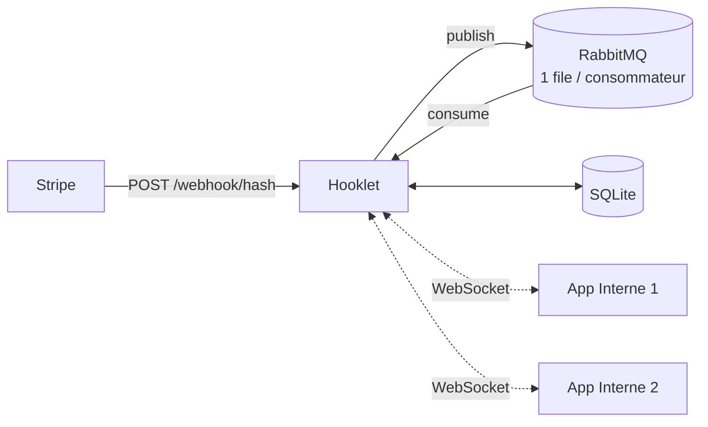

# 🪝 Hooklet

> Un relais de webhooks léger : recevez des webhooks sur un VPS public et streamez-les vers vos applications internes via WebSocket.

```text
[Stripe/GitHub] ──POST──▶ [Hooklet VPS] ══WebSocket══▶ [App interne (NAT)]
```

Pas besoin d'ouvrir de ports entrants sur vos applications ni d'utiliser ngrok.

- **⚡ Temps réel** via WebSocket
- **📡 Multi-topics** sur une seule connexion (`orders.*`, `**`)
- **🐰 Fiable** : file d'attente RabbitMQ (rétention des messages en cas de déconnexion)
- **🔒 Sécurisé** : authentification par token, URLs de webhooks hashées

---

## 🚀 Démarrage rapide

### 1. Lancement

```bash
# Lancer RabbitMQ
docker-compose up -d

# Compiler
go build -o hooklet ./cmd/service
go build -o hooklet-cli ./cmd/cli

# Démarrer le serveur
./hooklet
```

### 2. Créer un Webhook (Producteur)

```bash
# L'option --with-token sécurise la réception (optionnel)
./hooklet-cli webhook create stripe-payments --with-token
```
L'API retournera une URL hashée (`/webhook/a1b2c3...`) et un token secret.  
Pour publier un événement, le fournisseur (Stripe, etc.) devra faire un POST sur cette URL (avec le header `X-Hooklet-Token: <token>` si activé).

### 3. Créer un Consommateur (Client WebSocket)

```bash
./hooklet-cli consumer create my-app --subscriptions=stripe-payments
```
Un token vous sera retourné pour l'authentification WebSocket.

### 4. Écouter les Webhooks

Connectez-vous en WebSocket avec le header `Authorization: Bearer <token>` :
`wss://localhost:8080/ws?topics=stripe-payments`

Les messages reçus auront ce format :

```json
{
  "status": "webhook",
  "id": "ddcn20h4aym8",
  "topic": "stripe-payments",
  "received_at": "2026-03-27T15:12:01.123456Z",
  "source": {
    "webhook_id": 1,
    "webhook_name": "stripe-payments"
  },
  "data": { "event": "payment.succeeded" }
}
```
*(Si le body reçu n'est pas du JSON valide, Hooklet enverra `data_raw_base64` au lieu de `data`)*

---

## 📖 Exemples de Clients WebSocket

<details>
<summary><b>Go</b></summary>

```go
headers := http.Header{}
headers.Set("Authorization", "Bearer my-app-xxx")

conn, _, _ := websocket.Dial(ctx, "ws://localhost:8080/ws?topics=stripe-payments", &websocket.DialOptions{
    HTTPHeader: headers,
})
// ... boucle de lecture conn.Read(ctx)
```
</details>

<details>
<summary><b>Node.js</b></summary>

```javascript
const WebSocket = require('ws');

const ws = new WebSocket('ws://localhost:8080/ws?topics=stripe-payments', {
    headers: { 'Authorization': 'Bearer my-app-xxx' }
});

ws.on('message', (data) => console.log('Webhook:', JSON.parse(data)));
```
> En JS côté navigateur (où les headers custom sont interdits), envoyez l'auth au premier message :
> `ws.onopen = () => ws.send(JSON.stringify({type: 'auth', token: 'my-app-xxx'}));`
</details>

<details>
<summary><b>Python</b></summary>

```python
import websockets, asyncio

async def listen():
    async with websockets.connect(
        "ws://localhost:8080/ws?topics=stripe-payments",
        extra_headers={"Authorization": "Bearer my-app-xxx"}
    ) as ws:
        async for message in ws:
            print(message)

asyncio.run(listen())
```
</details>

---

## 🛠️ Commandes CLI

Le CLI communique avec le service via un socket Unix local.

```bash
# Webhooks (Sources)
hooklet-cli webhook create <name> [--with-token]
hooklet-cli webhook list
hooklet-cli webhook delete <id>
hooklet-cli webhook set-token <id>    # (Re)Génère le token de publication
hooklet-cli webhook clear-token <id>  # Supprime l'authentification

# Consommateurs (Clients)
hooklet-cli consumer create <name> [--subscriptions=topic1,topic2]
hooklet-cli consumer list
hooklet-cli consumer delete <id>
hooklet-cli consumer regen-token <id>

# Abonnements (Patterns acceptés : exact, 'topic.*', '**')
hooklet-cli consumer subscribe <id> --topic=<pattern>
hooklet-cli consumer unsubscribe <id> --topic=<pattern>
hooklet-cli consumer set-subs <id> --subscriptions=<patterns>

# Supervision
hooklet-cli status
```

---

## ⚙️ Configuration

| Variable d'environnement | Défaut | Description |
|-------------------------|---------|-------------|
| `PORT` | `8080` | Port HTTP |
| `RABBITMQ_URL` | | URL complète (écrase les variables HOST/PORT/USER/PASS) |
| `RABBITMQ_HOST` / `PORT` | `localhost` / `5672` | Identifiants RabbitMQ |
| `RABBITMQ_USER` / `PASS` | `guest` / `guest` | Identifiants RabbitMQ |
| `HOOKLET_DB_PATH` | `./hooklet.db` | Chemin base SQLite |
| `HOOKLET_ADMIN_TOKEN` | — | Requis pour l'admin distante |
| `HOOKLET_MESSAGE_TTL` | `300000` | Rétention des messages en ms (5 min) |
| `HOOKLET_QUEUE_EXPIRY` | `3600000` | Expiration des files inactives (1h) |
| `HOOKLET_MAX_BODY_BYTES`| `1048576` | Taille max d'un webhook entrant (1 MB) |
| `HOOKLET_WS_ORIGINS` | — | Liste d'origines autorisées (CORS) (ex: `https://app.com`) |
| `HOOKLET_LOG_LEVEL` | `info` | Niveau de log (`debug`, `info`, `warn`, `error`) |

---

## 🏗️ Architecture


```mermaid
flowchart LR
    Stripe -->|POST /webhook/hash| Hooklet
    Hooklet -->|publish| RabbitMQ[("RabbitMQ\n1 file / consommateur")]
    RabbitMQ -->|consume| Hooklet
    Hooklet <--> SQLite[(SQLite)]
    Hooklet <-.->|WebSocket| App1[App Interne 1]
    Hooklet <-.->|WebSocket| App2[App Interne 2]
```

- Chaque consommateur possède **une file RabbitMQ dédiée** (`hooklet-ws-<nom>-<id>`).
- S'il se déconnecte, les messages s'accumulent (jusqu'à `HOOKLET_MESSAGE_TTL`) et lui sont envoyés à sa reconnexion.
- Une seule connexion WebSocket active par consommateur est autorisée (la nouvelle remplace l'ancienne).

---

## 🔒 Production

1. **Proxy Inversé & TLS obligatoire** : Placez Nginx, Traefik ou Caddy devant Hooklet pour chiffrer le trafic en `HTTPS/WSS`.
2. **Ne logguez pas les tokens** : Configurez votre proxy pour exclure l'entête HTTP `Authorization` de vos logs d'accès.
3. **Administration à distance** : Protégez vos appels CLI distants avec `export HOOKLET_ADMIN_TOKEN=secret`.
